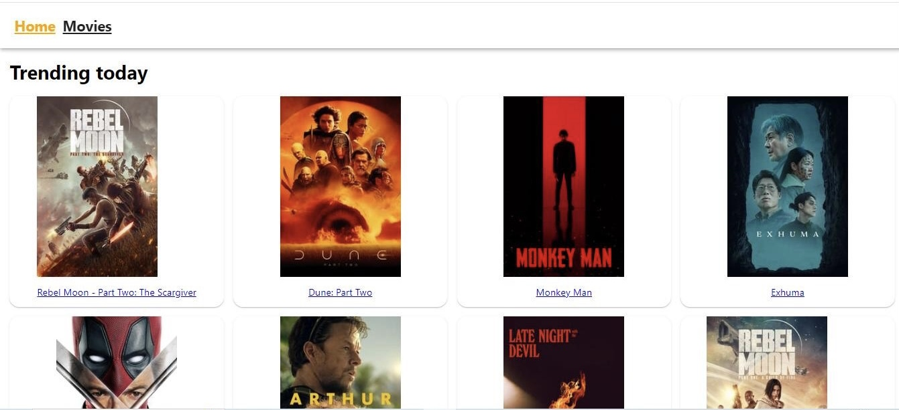

# Filmoteka

This project was created with
[Create React App](https://github.com/facebook/create-react-app).

## About

movie search app. Trending movies are displayed on the home page. By going to
the search page, you can find a movie by keyword and view detailed information
about the movie. Done routing with react-router-dom.

## Technologies used:

- JavaScript
- React
- HTML
- CSS
- Git
- GitHub

## Used libraries:

- axios
- formik
- react-loader-spinner
- react-router-dom
- styled-components
- react-hot-toast
- react-icons
- react-loader-spinner
